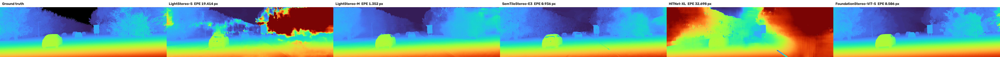

# Scene18 native-resolution model comparison (not an ablation)

This is a **single-image diagnostic** on VKITTI2 `Scene18/clone/Camera_0,1/frame_00259`, not a held-out benchmark or an ablation. It compares five native-pixel predictions side by side: LightStereo-S, LightStereo-M, SemTileStereo-E3, HITNet-XL, and FoundationStereo-ViT-S. The standard PyTorch HITNet-SF is included as an additional checkpoint sanity check.

All panels use the same Turbo scale, 0–80 disparity pixels; black denotes invalid/nonpositive output or invalid ground-truth depth. The input pair is 1242×375 with **no resizing**. LightStereo and FoundationStereo pad to architecture multiples and unpad afterward; HITNet pads internally. E3 uses its release inference path and exactly reproduces `examples/semtilestereo/Scene18/result.npz` (mean absolute difference 0). The trained E3 checkpoint is project-owned; every external comparison checkpoint is loaded from `/media/abrar/AbrarSSD/ResearchArtifacts/SVDE/external_weights/`.

## Metrics

| Model | EPE ↓ px | RMSE ↓ px | Bad 0.5 ↓ % | Bad 1 ↓ % | Bad 2 ↓ % | Bad 3 ↓ % | D1 ↓ % |
|---|---:|---:|---:|---:|---:|---:|---:|
| FoundationStereo-ViT-S | 0.506 | 1.436 | 20.15 | 11.84 | 6.25 | 4.15 | 4.15 |
| SemTileStereo-E3 | 0.936 | 1.886 | 41.57 | 25.31 | 12.55 | 7.24 | 7.24 |
| LightStereo-M | 1.352 | 2.678 | 52.77 | 30.55 | 16.50 | 11.37 | 11.36 |
| LightStereo-S | 19.414 | 36.743 | 78.40 | 66.02 | 53.29 | 46.35 | 46.27 |
| HITNet-XL (converted TF checkpoint) | 32.698 | 41.569 | 84.47 | 81.32 | 78.79 | 77.04 | 76.96 |
| HITNet-SF (additional PyTorch checkpoint) | 55.046 | 74.947 | 82.32 | 77.91 | 74.00 | 71.99 | 71.97 |

The same 426,577 valid GT pixels are used for each row: uint16 VKITTI depth in centimetres, `d = 100 × fx × baseline_m / depth_cm`, `fx = 725.0087 px`, `baseline = 0.532725 m`, `0 < d < 192`, finite prediction, and `x ≥ d` to exclude left-border correspondences. EPE is mean absolute disparity error; RMSE is root mean squared error; bad-`t` is the percentage with absolute error > `t` px; D1 is the percentage with error > 3 px **and** > 5% of GT disparity. Ground truth came from the exact member `Scene18/clone/frames/depth/Camera_0/depth_00259.png` of the `svde-vkitti2` Modal archive. The source frame is in the E3 **training split**, so E3's result cannot support generalization claims.

The unusually poor LightStereo-S and HITNet outputs are visible in the montage, not a colormap artifact. Their checkpoints load strictly into the expected architectures; nevertheless, this one-frame result is not enough to distinguish domain failure from model-specific inference compatibility. HITNet was run in FP16 because its native full-width cost volume exhausted the local 4 GB GPU in FP32. Do not use these rows as published model rankings without validating each loader on its source dataset and repeating the comparison over a held-out VKITTI or real-world test set. The elapsed times in `results.json` **include model load** and are not inference-latency measurements.

## Reproduction and files

Run `uv run --no-sync python comparisons/scene18_clone_00259_native_v1_20261004/run.py --model LightStereo-M`, substituting any of the five panel names or `HITNet-SF`; `--model montage` rebuilds the figure. `fetch_gt_modal.py` retrieves only this depth PNG if it is missing. `results.json` records precise metrics and checkpoint SHA-256 hashes. Each raw native disparity is saved as `<model>.npy` and a fixed-scale PNG as `<model>.png`; generated images/arrays are ignored by Git.

Weight sources: [OpenStereo LightStereo](https://huggingface.co/XiandaGuo/OpenStereo/tree/main/checkpoint/LightStereo), [TinyHITNet PyTorch implementation](https://github.com/zjjMaiMai/TinyHITNet), and the local [FoundationStereo](https://github.com/NVlabs/FoundationStereo) ViT-S checkpoint. Do not redistribute upstream weights without checking their licenses.
