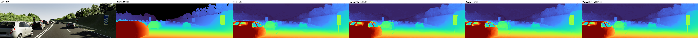

# G-series 10k visual-edge ablation: results and verdict

Run: `g_edge_native_seed42_10k_v2_20261004` · local RTX 3050 Laptop GPU
· queue status **complete** · 10,000 optimizer steps per arm. The superseded
4,000-step queue is preserved as `cancelled_protocol_mismatch`; its results
are not used below.

## Verdict

**None of the G heads makes the released E3 disparity visibly sharper.** In
the saved full-resolution sheets, G1, G2 and G3 look almost identical to
frozen E3 at normal viewing size. Zooming in on vehicle silhouettes and the
roadside/vegetation transitions shows minor pixel changes, but not the clean,
GT-like boundary separation we wanted. G3 has the best measured edge-region
EPE, improving only 0.031 px (1.3%) over E3 while making overall EPE, bad-0.5,
bad-1 and bad-2 worse. This is not a convincing visual upgrade. Keep released
E3 unchanged; do **not** substitute any G checkpoint as the release model.

The figure uses one 0–80 px Turbo disparity scale for every model. The other
native-resolution Scene20 clone comparisons are in the `visuals/` directory of
each arm's run, including frames `00000` and `00044`. These generated sheets
are local artifacts; the representative figure above is retained with this
report.

## Test metrics

All values below use the same 100 Scene20 test pairs and **37,491,855** valid
GT pixels. Lower is better. Bad and D1 columns are percentages; edge EPE and
the other errors are native disparity pixels. Parameter counts exclude the
frozen E3 model.

| Model | Selected step | Trainable params | EPE | RMSE | Bad-0.5 | Bad-1 | Bad-2 | Bad-3 | D1 | Edge EPE |
|---|---:|---:|---:|---:|---:|---:|---:|---:|---:|---:|
| Frozen E3 | — | 0 | **1.5930** | 5.2605 | **38.604** | **21.906** | **12.266** | 8.934 | 8.691 | 2.4346 |
| G1 RGB residual | 7,000 | 6,313 | 1.5969 | 5.2706 | 39.020 | 21.913 | **12.227** | **8.905** | 8.659 | 2.4258 |
| G2 local convex candidate | 7,000 | 9,155 | 1.5962 | **5.2582** | 39.232 | 22.107 | 12.271 | 8.905 | **8.655** | 2.4159 |
| G3 + stereo warp correction | 9,000 | 16,980 | 1.6016 | 5.2672 | 39.492 | 22.089 | 12.286 | 8.928 | 8.677 | **2.4035** |

The baseline was rerun with an identity-initialized head for the edge metric;
the three arm evaluations independently record baseline EPE 1.59300–1.59301,
so run-to-run numerical drift is negligible compared with the table precision.
The edge mask includes pixels within a 5×5 neighborhood of a >2 px jump in
valid ground-truth disparity: 3,799,472 test pixels. The standard evaluation
mask is finite GT with `0 < disparity < 192` px; bad-`t` means absolute error
`> t` px, and D1 means error `> 3` px **and** `> 5%` of GT disparity.

Relative to frozen E3, test EPE changes are **+0.0039**, **+0.0032** and
**+0.0086** px for G1/G2/G3; edge EPE changes are **−0.0087**, **−0.0187**
and **−0.0311** px. These are very small trade-offs, not a new edge-quality
regime. G1/G2 improve overall EPE on only **32/100** and **33/100** test pairs,
respectively; G3 improves **30/100**. Grouping the ten variations of each
source frame, G1/G2 improve only **2/10** source frames and G3 improves
**0/10**. See [`paired_analysis.json`](paired_analysis.json) for frame-level
deltas; this grouping is more honest than treating all 100 variations as
independent scenes.

Validation tells the same small-change story: frozen E3 edge EPE was 2.5414;
the selected G1/G2/G3 checkpoints reached 2.5348, 2.5196 and 2.5104. The
validation-selected step, not the test result, determined each checkpoint.

## What was actually tested

- G1 adds a bounded full-resolution RGB-guided residual (`±2` px) after frozen
  E3 output.
- G2 adds a nine-neighbor candidate reconstructed from E3's half-resolution
  tile disparity. Its nine weights are softmax-normalized, **but the final
  blend is unconstrained in sign**. The selected G2/G3 blend parameters are
  approximately −0.099/−0.089, so the final operator can extrapolate away
  from the convex candidate. This is *not* a faithful strict-convex-upsample
  test; the arm name is historical shorthand.
- G3 additionally warps the right RGB image with the current disparity and
  predicts a bounded (`±4` px) residual from left/right appearance.

The result rejects these **specific cheap post-E3 heads** as a visible
sharpening solution. It does not reject FoundationStereo's learned upsampling
or iterative stereo refinement: those operate inside a richer matching
pipeline and use higher-resolution context before the final disparity is
already smoothed. A future test would need a genuinely nonnegative
image-guided upsampler integrated before E3's final reconstruction, with a
separate visual check. Merely increasing these G heads' capacity is not
supported by this result.

## Reproducibility and limits

The split is the fixed-seed VKITTI2 1,000-pair `ablation1000` manifest:
800 train, 100 validation, 100 test. Scene20's 20 source frames are split
10/10 across validation/test, with all ten variations of each frame kept
together. Inputs are never resized; training uses paired native-pixel
256×512 crops and evaluation uses top/right padding removed before scoring.
All E3 predictors and weights remain frozen. AdamW + OneCycle runs for 10k
steps, using valid Smooth-L1, bad-1 hinge and an edge-region Smooth-L1 term.
Checkpoint selection is lowest validation edge EPE; the test split is scored
afterward. Exact hashes, steps, split records and GPU name are in each arm's
`manifest.json`; exact metrics and per-pair results are in each `test.json`.

This is **in-domain visual screening**. The E3 semantic and depth teachers
were trained on full VKITTI, so this test cannot establish independent
generalization. Three saved clone frames were visually inspected; they show
no substantial sharpening, but they do not substitute for a blinded visual
rating over the full test set.
